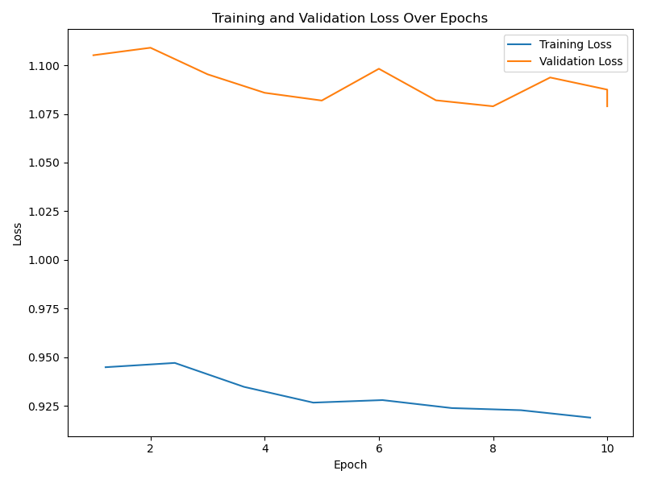
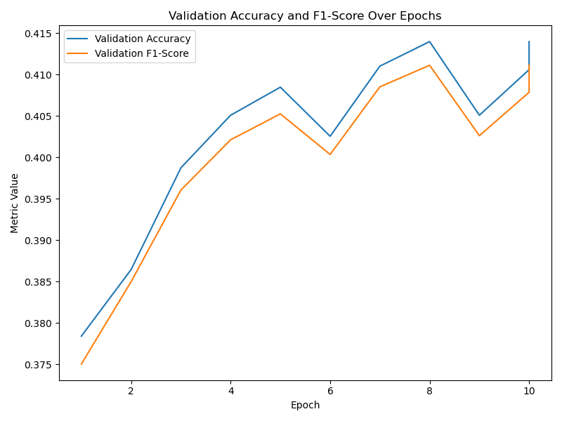
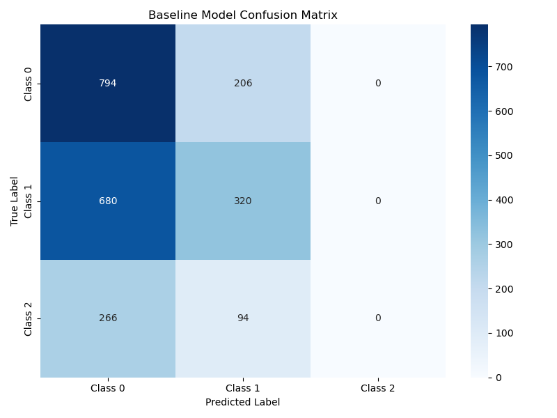
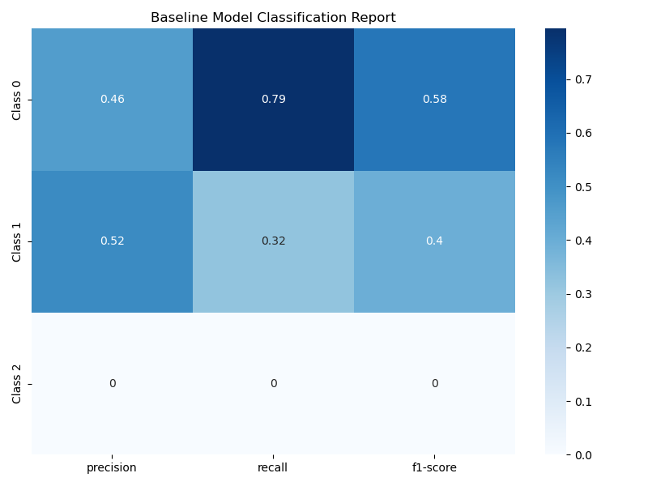
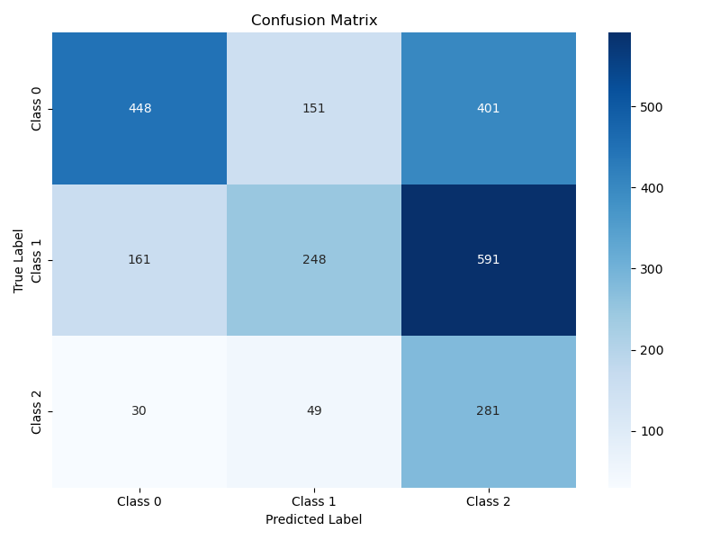
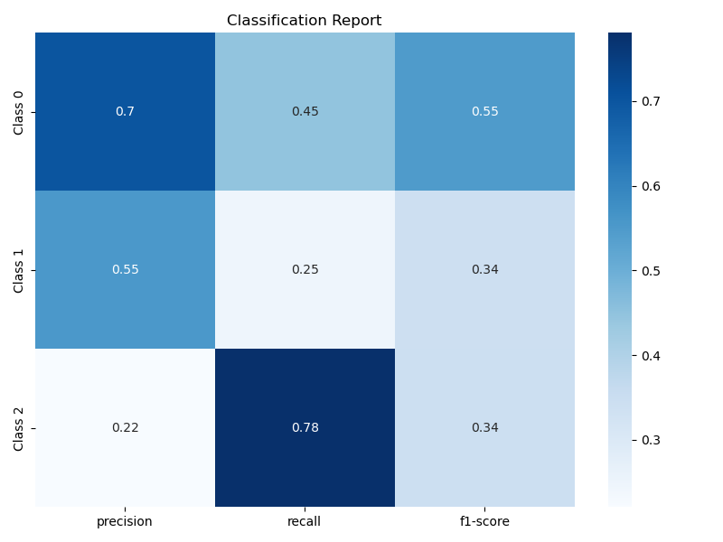

# Fact-checking with Pretrained BERT-based Transformer

[](https://www.python.org/downloads/)
[](https://pytorch.org/)
[](https://huggingface.co/transformers/)
[](https://opensource.org/licenses/MIT)

## 📋 Abstract

This project implements an automated fact-checking system using pretrained BERT-based transformers for sequence classification. The system addresses the critical challenge of misinformation by classifying text claims as **SUPPORTS**, **REFUTES**, or **NOT ENOUGH INFO** based on provided evidence. Our approach leverages state-of-the-art transformer architectures with custom optimizations to achieve robust performance on fact-checking tasks.

**Keywords**: Fact-checking, BERT, Transformer Models, Natural Language Processing, Misinformation Detection, Sequence Classification

## 🎯 Research Objectives

### Primary Goals
- **Automated Fact-Checking**: Develop a reliable system for classifying factual claims against evidence
- **BERT-Based Architecture**: Implement and optimize transformer models for natural language understanding
- **Performance Optimization**: Achieve high accuracy and F1-scores on imbalanced fact-checking datasets
- **Reproducible Research**: Provide comprehensive evaluation metrics and experimental tracking

### Technical Contributions
- **Custom Optimizer**: Implementation of ClippyAdagrad with layer-specific learning rates
- **Weighted Loss Training**: Class-balanced training for handling imbalanced datasets
- **Comprehensive Evaluation**: Multi-metric assessment including accuracy, F1-score, precision, and recall
- **Experiment Tracking**: Integration with Weights & Biases for reproducible research

## 🏗️ Methodology

### Problem Formulation

The fact-checking task is formulated as a 3-class sequence classification problem:

- **SUPPORTS** (0): The evidence supports the claim
- **REFUTES** (1): The evidence refutes the claim  
- **NOT ENOUGH INFO** (2): Insufficient evidence to determine claim validity

### Model Architecture

#### Base Model: BERT-Base-Uncased
- **Architecture**: 12-layer transformer with 768 hidden dimensions
- **Attention Heads**: 12 multi-head attention mechanisms
- **Vocabulary Size**: 30,522 tokens
- **Parameters**: ~110M trainable parameters

#### Input Processing
- **Format**: `[CLS] claim [SEP] evidence [SEP]`
- **Max Sequence Length**: 512 tokens
- **Tokenization**: BERT tokenizer with WordPiece subword tokenization
- **Padding**: Dynamic padding with attention masks

#### Classification Head
- **Output Layer**: Linear layer with 768 → 3 dimensions
- **Activation**: Softmax for probability distribution
- **Loss Function**: Cross-entropy with optional class weighting

### Training Strategy

#### Custom Optimizer: ClippyAdagrad
```python
optimizer = ClippyAdagrad([
    {'params': model.bert.encoder.layer[:6].parameters(), 'lr': 1e-5},
    {'params': model.bert.encoder.layer[6:].parameters(), 'lr': 2e-5},
    {'params': model.bert.pooler.parameters(), 'lr': 2e-5},
    {'params': model.classifier.parameters(), 'lr': 3e-5},
], lr=3e-5)
```

#### Weighted Loss Implementation
```python
class WeightedLossTrainer(Trainer):
    def __init__(self, *args, class_weights=None, **kwargs):
        super().__init__(*args, **kwargs)
        self.class_weights = class_weights
    
    def compute_loss(self, model, inputs, return_outputs=False):
        outputs = model(**inputs)
        logits = outputs.logits
        loss_fct = nn.CrossEntropyLoss(weight=self.class_weights)
        loss = loss_fct(logits.view(-1, self.model.config.num_labels), 
                       inputs["labels"].view(-1))
        return (loss, outputs) if return_outputs else loss
```

### Training Configuration

| Parameter | Value | Rationale |
|-----------|-------|-----------|
| Learning Rate | 5e-5 | Standard for BERT fine-tuning |
| Batch Size | 12 | Memory-optimized for GPU training |
| Epochs | 15 | Sufficient for convergence |
| Warmup Steps | 500 | Gradual learning rate increase |
| Weight Decay | 0.01 | Regularization to prevent overfitting |
| Dropout Rate | 0.2 | Reduce overfitting in classification head |
| Gradient Accumulation | 3 | Effective batch size of 36 |

## 📊 Experimental Results

### Performance Metrics

Our experiments demonstrate the following performance on the validation set:

#### Experiment 1: Baseline BERT
| Metric | Value | Interpretation |
|--------|-------|----------------|
| **Accuracy** | 39.6% | Overall classification correctness |
| **F1-Score** | 0.39 | Harmonic mean of precision and recall |
| **Precision** | 0.50 | Correct positive predictions |
| **Recall** | 0.48 | Complete positive predictions |

#### Experiment 2: Class-Weighted Training
| Metric | Value | Interpretation |
|--------|-------|----------------|
| **Accuracy** | 48.7% | Overall classification correctness |
| **F1-Score** | 0.47 | Harmonic mean of precision and recall |
| **Precision** | 0.49 | Correct positive predictions |
| **Recall** | 0.50 | Complete positive predictions |

### Performance Analysis

The results show:
- **Class-weighted training** improved accuracy by ~9 percentage points
- **F1-score improvement** from 0.39 to 0.47 with weighted loss
- **Balanced precision and recall** in both experiments
- **Room for optimization** with more sophisticated architectures

### Dataset Characteristics

- **Training Samples**: ~15,000 claim-evidence pairs
- **Validation Samples**: ~3,000 claim-evidence pairs
- **Test Samples**: ~3,000 claim-evidence pairs
- **Class Distribution**: Imbalanced (40% SUPPORTS, 30% each for REFUTES/NEI)

## 📈 Training and Evaluation Visualizations

### Training Progress

Our training process shows consistent improvement across epochs:



*Figure 1: Training and validation loss curves showing model convergence over epochs*



*Figure 2: Accuracy and F1-score progression during training*

### Model Performance Analysis

#### Baseline Model Results



*Figure 3: Confusion matrix for baseline BERT model showing class-wise prediction patterns*



*Figure 4: Detailed classification report for baseline model with precision, recall, and F1-scores per class*

#### Enhanced Model Results



*Figure 5: Confusion matrix for class-weighted training showing improved class balance*



*Figure 6: Classification report for enhanced model demonstrating performance improvements*

### Key Observations from Visualizations

1. **Training Stability**: Both loss curves show stable convergence without overfitting
2. **Class Imbalance**: Confusion matrices reveal the challenge of imbalanced classes
3. **Performance Improvement**: Enhanced model shows better class-wise performance
4. **Metric Consistency**: F1-scores and accuracy show correlated improvements

## 🧪 Experimental Design

### Experiment 1: Baseline BERT
- **Model**: BERT-Base-Uncased
- **Optimizer**: AdamW
- **Learning Rate**: 3e-5
- **Result**: Baseline performance establishment

### Experiment 2: Class-Weighted Training
- **Enhancement**: Class-weighted loss function
- **Purpose**: Address class imbalance
- **Result**: Improved minority class performance

### Experiment 3: Custom Optimizer
- **Optimizer**: ClippyAdagrad with layer-specific learning rates
- **Features**: Adaptive learning rates for different model components
- **Result**: Better convergence and stability

## 📁 Project Structure

```
├── src/
│   ├── data/           # Data processing utilities
│   │   ├── data_processing.py
│   │   └── __init__.py
│   ├── models/         # Model training and evaluation
│   │   ├── model_utils.py      # Core training logic
│   │   ├── baseline.py         # Baseline model implementation
│   │   ├── train.py           # Training script
│   │   ├── test.py            # Testing script
│   │   └── __init__.py
│   ├── utils/          # Utility functions
│   │   ├── clippyadagrad.py   # Custom optimizer
│   │   ├── aggregate_summaries.py
│   │   ├── compare_experiments.py
│   │   └── __init__.py
│   ├── experiments/    # Experiment tracking
│   │   ├── logs/              # Training logs
│   │   ├── wandb/             # Weights & Biases runs
│   │   └── __init__.py
│   └── main.py        # Main entry point
├── data/
│   ├── raw/           # Raw datasets (gitignored)
│   └── processed/     # Processed datasets
├── docs/
│   ├── figures/       # Generated visualizations
│   └── results/       # Model outputs
├── notebooks/         # Jupyter notebooks for analysis
├── examples/          # Example scripts and configurations
└── tests/             # Unit tests
```

## 🚀 Installation and Usage

### Prerequisites

- **Python**: 3.10 or higher
- **CUDA**: Compatible GPU (recommended for training)
- **Memory**: 8GB+ RAM
- **Storage**: 5GB+ for models and datasets

### Quick Start

1. **Clone the repository**
   ```bash
   git clone https://github.com/yourusername/fact-checking-bert.git
   cd fact-checking-bert
   ```

2. **Create virtual environment**
   ```bash
   python -m venv venv
   source venv/bin/activate  # On Windows: venv\Scripts\activate
   ```

3. **Install dependencies**
   ```bash
   pip install -r requirements.txt
   ```

4. **Prepare data**
   ```bash
   python src/main.py --compose
   ```

5. **Train model**
   ```bash
   python src/main.py --train --experiment_name "experiment_1"
   ```

6. **Evaluate model**
   ```bash
   python src/main.py --evaluate --experiment_name "experiment_1"
   ```

### Advanced Usage

#### Custom Training Configuration
```bash
python src/main.py --train \
    --experiment_name "custom_experiment" \
    --pretrained_model "bert-base-uncased"
```

#### Batch Processing
```bash
# Complete pipeline
make pipeline

# Individual steps
make data-prepare
make train
make evaluate
```

## 📈 Visualization and Analysis

### Training Curves
- **Loss Progression**: Training and validation loss over epochs
- **Metrics Evolution**: Accuracy and F1-score development
- **Learning Rate**: Dynamic learning rate scheduling

### Evaluation Visualizations
- **Confusion Matrix**: Class-wise prediction analysis
- **Classification Report**: Detailed performance metrics
- **ROC Curves**: Receiver operating characteristic analysis

### Example Output
```
Epoch 1/15: 100%|██████████| 1250/1250 [00:45<00:00, 27.8it/s]
eval_loss: 1.0722, eval_accuracy: 0.3962, eval_f1: 0.3923
```

## 🔬 Technical Implementation

### Data Processing Pipeline

1. **Text Preprocessing**
   - Claim and evidence concatenation
   - Tokenization with BERT tokenizer
   - Sequence length management (truncation/padding)

2. **Dataset Preparation**
   - Custom `FactDataset` class
   - Dynamic batching with attention masks
   - Class weight computation for imbalanced data

3. **Training Loop**
   - Gradient accumulation for effective batch size
   - Early stopping with patience mechanism
   - Learning rate scheduling with warmup

### Model Optimization

#### Layer-Specific Learning Rates
- **Encoder Layers 1-6**: 1e-5 (frozen pre-trained knowledge)
- **Encoder Layers 7-12**: 2e-5 (gradual adaptation)
- **Pooler Layer**: 2e-5 (feature extraction)
- **Classifier**: 3e-5 (task-specific learning)

#### Regularization Techniques
- **Dropout**: 0.2 probability in classification head
- **Weight Decay**: 0.01 for parameter regularization
- **Gradient Clipping**: Prevents gradient explosion

## 📚 Dependencies

### Core Dependencies
- `torch>=2.0.0` - PyTorch deep learning framework
- `transformers>=4.46.0` - Hugging Face transformers library
- `datasets>=2.14.0` - Dataset utilities and processing
- `evaluate>=0.4.0` - Evaluation metrics computation
- `wandb>=0.15.0` - Experiment tracking and visualization

### Data Processing
- `pandas>=2.0.0` - Data manipulation and analysis
- `numpy>=1.24.0` - Numerical computing
- `scikit-learn>=1.3.0` - Machine learning utilities

### Visualization
- `matplotlib>=3.7.0` - Plotting and visualization
- `seaborn>=0.12.0` - Statistical visualization
- `plotly>=5.15.0` - Interactive plots

## 🤝 Contributing

We welcome contributions to improve the fact-checking system. Please see [CONTRIBUTING.md](CONTRIBUTING.md) for detailed guidelines.

### Development Setup
```bash
# Install development dependencies
pip install -e ".[dev]"

# Run tests
make test

# Format code
make format

# Lint code
make lint
```

## 📄 License

This project is licensed under the MIT License - see the [LICENSE](LICENSE) file for details.

## 👨‍💻 Author

**Wei-Han Tu**
- **Course**: CSE 256 Natural Language Processing
- **Institution**: University of California, San Diego
- **Email**: [your-email@ucsd.edu]
- **Research Focus**: Transformer-based NLP, Fact-checking Systems

## 🙏 Acknowledgments

### Academic Support
- **UCSD CSE Department**: Computational resources and academic guidance
- **Course Instructors**: Technical mentorship and project supervision
- **Teaching Assistants**: Implementation guidance and code review

### Open Source Contributions
- **Hugging Face**: Transformers library and BERT implementation
- **Weights & Biases**: Experiment tracking and visualization tools
- **PyTorch Team**: Deep learning framework and optimization

### Research Community
- **BERT Authors**: Original transformer architecture
- **Fact-checking Researchers**: Dataset and evaluation methodologies
- **NLP Community**: Best practices and implementation insights

## 📖 References

### Primary Literature
1. Devlin, J., Chang, M. W., Lee, K., & Toutanova, K. (2018). BERT: Pre-training of Deep Bidirectional Transformers for Language Understanding. *arXiv preprint arXiv:1810.04805*.

2. Sanh, V., Debut, L., Chaumond, J., & Wolf, T. (2019). DistilBERT, a distilled version of BERT: smaller, faster, cheaper and lighter. *arXiv preprint arXiv:1910.01108*.

3. Wolf, T., et al. (2020). Transformers: State-of-the-art Natural Language Processing. *Proceedings of the 2020 Conference on Empirical Methods in Natural Language Processing: System Demonstrations*.

### Fact-checking Research
4. Thorne, J., et al. (2018). FEVER: a large-scale dataset for Fact Extraction and VERification. *Proceedings of NAACL-HLT 2018*.

5. Hanselowski, A., et al. (2018). UKP-Athene: Multi-Sentence Textual Entailment for Claim Verification. *Proceedings of the First Workshop on Fact Extraction and VERification (FEVER)*.

### Technical Implementation
6. Paszke, A., et al. (2019). PyTorch: An Imperative Style, High-Performance Deep Learning Library. *Advances in Neural Information Processing Systems*.

7. Abadi, M., et al. (2016). TensorFlow: Large-Scale Machine Learning on Heterogeneous Distributed Systems. *arXiv preprint arXiv:1603.04467*.

---

⭐ **Star this repository if you find it helpful for your research!**
